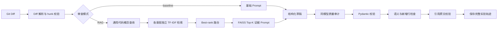

# 基于 RAG 的代码审查智能体

一个可复现的代码审查原型：输入 unified Git Diff，输出结构化审查意见；在 RAG 模式下，
系统会从项目规范与外部安全文档中检索证据，并分别验证引用的原文一致性和结论支持性。

项目实现 baseline（纯 LLM）和 RAG 两条审查链，保存 5 组对照实验的完整 Prompt、模型原始
响应、最终结构化结果、检索轨迹和人工评分。该仓库用于展示工程流程和小规模受控实验，
不是生产级静态分析器，也不应把实验结果外推到真实大型代码库。

## 实验结果

2026-07-21 使用 `deepseek-chat`、`temperature=0` 完成 10 次模型调用。人工评分采用
[Rubric 2.0](experiment/evaluation_protocol.md)，聚合程序会与 ground truth 和结果 JSON
进行交叉校验。

| 指标 | baseline | RAG |
|---|---:|---:|
| 标注问题召回率 | 66.67%（4/6） | 100.00%（6/6） |
| 误报数 | 1 | 0 |
| 重复意见数 | 1 | 1 |
| 整体审查质量（1-5） | 3.2 | 3.8 |
| 已命中问题的建议质量（1-5） | 4.75（n=4） | 4.4（n=5） |
| 严重度准确率 | 100.00%（4/4） | 66.67%（4/6） |
| 精确定位率 | 25.00%（1/4） | 33.33%（2/6） |
| 无依据断言率 | 16.67%（1/6） | 0.00%（0/7） |
| 引用原文一致率 | 不适用 | 100.00%（6/6） |
| 引用支持率 | 不适用 | 100.00%（6/6） |

结果说明：在这 5 个合成样本中，RAG 提高了预定义问题的召回率并消除了一个依赖未知上下文
的误报，同时提供了可核验引用；但它没有提高已命中问题的建议质量，并出现两处严重度偏高、
多处定位不精确和一条重复意见。完整判分见
[experiment/analysis.md](experiment/analysis.md)。

## 核心流程



关键设计：

- unified diff 解析器校验 hunk 声明行数，并为新增行生成新文件行号。
- 文档按标题和段落切分，chunk 保存 `source`、`section`、`chunk_id` 和完整原文。
- 查询扩展只使用通用代码概念，不直接注入目标章节标题。
- 每个代码意图独立执行 TF-IDF + FAISS 检索，再用最佳倒数排名融合 Top-K。
- baseline 与 RAG 使用相同模型、温度、基础规则和两阶段质量审计。
- RAG 意见引用必须来自本轮检索 chunk，quote 必须能在对应原文中找到。
- `raw_attempts` 保存草稿、质量审计和必要的 JSON 修复响应，不隐藏失败尝试。
- 人工聚合程序同时核对 CSV、ground truth 和最终结果 JSON，拒绝重复行、分数越界、计数小数、
  样本缺失和不可对账的统计。

## 目录结构

```text
.
├── agent.py
├── requirements.txt
├── LICENSE                       # 本项目代码：MIT
├── THIRD_PARTY_NOTICES.md        # 外部知识文档的来源和许可
├── SECURITY.md
├── CONTRIBUTING.md
├── src/                          # Diff、检索、模型、审查、校验和评价逻辑
├── docs/
│   ├── knowledge/                # PEP 8、OWASP 和本项目设计约束
│   ├── licenses/                 # 第三方许可文本
│   ├── README.md                 # 知识来源、快照和许可说明
│   └── checksums.sha256          # 知识文档完整性摘要
├── experiment/
│   ├── samples/                  # 5 份 unified diff
│   ├── ground_truth.json         # 模型运行前确定的人工标注
│   ├── retrieval_validation/     # 5 份额外检索验证样本
│   ├── human_evaluation.csv      # Rubric 2.0 逐样本评分
│   ├── evaluation_protocol.md    # 字段定义与评分锚点
│   ├── analysis.md               # 对比分析
│   └── results/                  # 原始结果、检索审计和聚合指标
└── tests/
```

## 环境与安全边界

推荐 Python 3.12。模型调用会把待审查 diff、系统 Prompt 和检索证据发送到你配置的第三方
OpenAI-compatible API。不要提交包含商业机密、个人数据、访问令牌或未授权源码的 diff；
使用前应确认模型供应商的数据处理条款满足你的项目要求。

真实 `.env` 不属于仓库内容。复制 `.env.example` 后只在本地填写密钥：

### Windows PowerShell

```powershell
python -m venv .venv
.\.venv\Scripts\Activate.ps1
python -m pip install -r requirements.txt
Copy-Item .env.example .env
```

### macOS / Linux

```bash
python3 -m venv .venv
source .venv/bin/activate
python -m pip install -r requirements.txt
cp .env.example .env
```

配置示例：

```dotenv
LLM_API_KEY=
LLM_BASE_URL=https://api.deepseek.com
LLM_MODEL=deepseek-chat
LLM_TEMPERATURE=0
LLM_TIMEOUT_SECONDS=120
FAISS_PATH=.faiss
RETRIEVAL_TOP_K=5
```

`.env`、`.venv/`、`.faiss/` 和缓存目录均已加入 `.gitignore`。一旦密钥曾被公开，删除文件
不足以恢复安全性，应先在供应商处撤销或轮换密钥，再根据实际情况清理 Git 历史。

## 快速开始

检查配置并建立索引：

```bash
python agent.py doctor
python agent.py index
python agent.py audit-retrieval
```

当前知识库生成 107 个 chunk，主实验检索审计的 evidence recall@5 为 `6/6`。额外检索验证：

```bash
python agent.py audit-retrieval \
  --samples-dir experiment/retrieval_validation/samples \
  --ground-truth experiment/retrieval_validation/ground_truth.json \
  --output experiment/results/retrieval/validation_audit.json
```

单次审查：

```bash
python agent.py review --mode baseline --diff experiment/samples/case_03_sql_injection.diff
python agent.py review --mode rag --diff experiment/samples/case_03_sql_injection.diff
```

运行全部实验并重新聚合评分：

```bash
python agent.py experiment --mode both
python agent.py evaluate
```

`evaluate` 默认同时校验：

- `experiment/human_evaluation.csv`
- `experiment/ground_truth.json`
- `experiment/results/{baseline,rag}/*.json`

运行测试：

```bash
python -m pytest -q
```

## 输出结构

每条意见包含：

- `file`、`line_start`、`line_end`
- `category`、`severity`、`confidence`
- `problem`、`suggestion`、`explanation`
- `citations[]`：`source`、`section`、`chunk_id`、`quote`

实验结果还保存 `sample_sha256`、`prompt_version`、完整 Prompt、模型原始响应、检索 chunk、
引用检查、新增行检查和语义质量检查。结果 JSON 可能包含第三方知识文档的原文摘录，使用和
再分发时须同时遵守 [THIRD_PARTY_NOTICES.md](THIRD_PARTY_NOTICES.md)。

## 实验公平性与限制

- 两种模式使用同一个 `deepseek-chat` 模型和 `temperature=0`。
- 输入 diff、输出 schema、严重度定义和质量审计步骤相同。
- baseline 不接收知识片段；RAG 的额外信息来自检索原文。
- `ground_truth.json` 在模型实验前创建，避免按输出反向修改答案。
- 样本量仅为 5，且为合成 Python/Flask diff。
- 只使用一个服务端模型别名和一次运行，未估计随机方差或模型间差异。
- 当前只有一名人工评审者，没有 Cohen's kappa 等一致性指标。
- 检索 validation 参与流程改进，不能作为最终未见测试集。
- 程序的新增行检查不等于精确根因定位；精确性由人工字段单独评价。
- `deepseek-chat` 是服务端别名，未来复现实验时底层模型可能变化。

## 开源许可

本项目原创代码和原创文档采用 [MIT License](LICENSE)。第三方知识文档及其摘录保留各自
许可：PEP 8 已声明置于公有领域；OWASP SQL Injection Prevention Cheat Sheet 采用
CC BY-SA 4.0。具体归属、来源和许可范围见 [THIRD_PARTY_NOTICES.md](THIRD_PARTY_NOTICES.md)。
